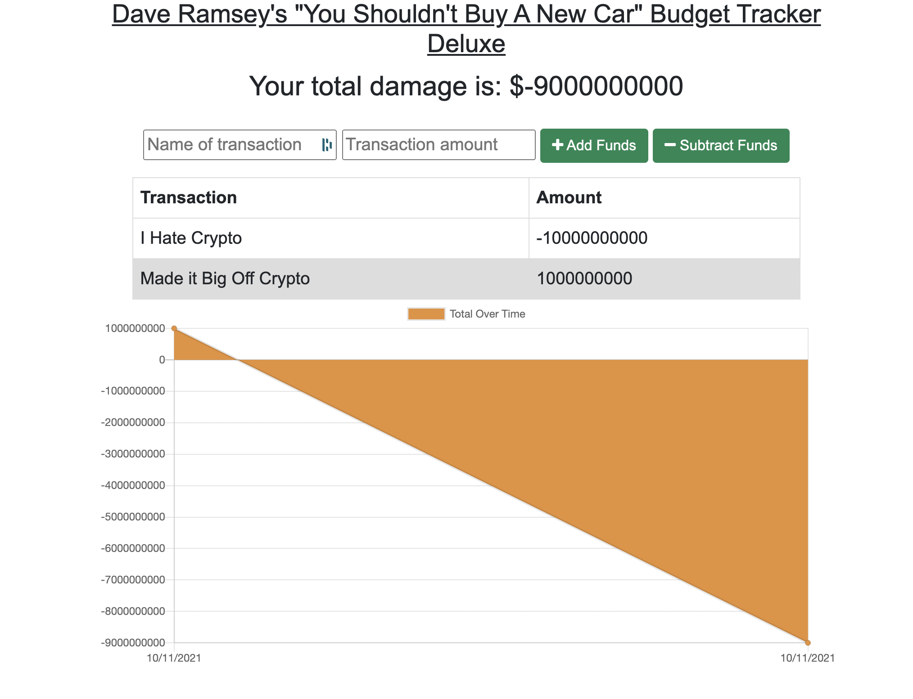

# pwa-app

## Description

- Dave's Budget Tracker Deluxe is an application to help you learn how to manage your money.
- This application takes debits and credits to you total budget, and outputs a chart based on what you have earned and spent.
- This application can also be used offline & downloaded.

## How To Use

- First, go to the link included below in the "Go To Application" section
  - Or, clone this repo to your computer and download run
  ```
  npm i
  ```
  to download the dependencies to run it locally on your device.
- Once you are within the application, simply follow the inputs on the screen to add/subtract money.
- If you want to download the application, simply click the download button that appears in your browswer's search bar.

## Go To Application

[Application](https://shrouded-springs-44297.herokuapp.com/)

## Screenshot



## Questions

- If you have any questions about this application please feel free to contact me via Github.

## License

MIT
